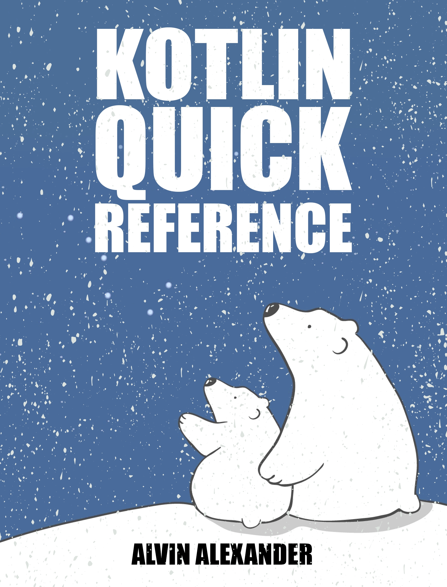

*Kotlin Quick Reference*    

# Introduction

[Kotlin Quick Reference](http://kotlin-quick-reference.com) is intended to provide a quick reference to the [Kotlin programming language](https://kotlinlang.org/). Each chapter in the book demonstrates Kotlin syntax and provides examples to explain the chapter’s topic. This is done in a brisk manner, with as few words as necessary.

## Audience

Because this book provides only a quick reference to the Kotlin language, it’s intended for developers who have experience in other programming languages and just need a fast reference to Kotlin features. If you need a more complete book, [Kotlin in Action](https://amzn.to/2DJtTAW) is an excellent resource.

